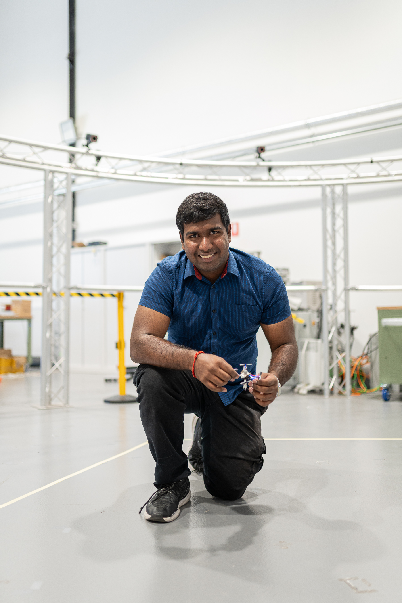

# Hi 👋, I'm Avvienash Jaganathan

     
 📫 [avvienash@gmail.com](mailto:avvienash@gmail.com)  
📞 +61 423 617 837  
🔗 [https://linkedin.com/in/avvienash-jaganathan](https://linkedin.com/in/avvienash-jaganathan)

---

## 🔭 Profile

As a Robotics and Mechatronics Engineering graduate from Monash University, I am deeply invested in AI and automation. My experience includes leading a team of Deep Learning Engineers at Monash Deep Neuron, an R&D Engineering Internship at INTRIX, and significant research in autonomous drone trajectory generation and vehicle navigation. I am eager to leverage my skills and continue my professional growth in a challenging and innovative environment.

---

## 🎓Education

**Bachelor of Robotics and mechatronics engineering (Honours) in Artificial Intelligence**  
*Monash University, Clayton (October 2020 – July 2024)*
- Developed a Ball-in-Maze Autonomous Solving Robot using Computer Vision and Control Systems.
- Created a Parcel Delivery Mobile Robot with mapping, inter-agent communication, and RFID parcel detection.
- Engineered an Automated Fruit Collecting Robot featuring SLAM, Mapping, Digital Twin, and Object Detection.
- Designed a control system for the DJI Tello drone using hand gestures and facial detection/tracking.
- Built an Ultrasonic Reverse Sensor with audible and visual distance detection with custom PCB.
- Designed a Recyclable Waste Separator Control System using CIROS Education automation cells and PLC programming.
- Achieved first runner-up in the 2022 Warman Design and Build competition.
- Led weapon design and construction team for Monash at ROBOCON 2022.
- Certified SolidWorks Associate in Mechanical Design (CSWA).

---

## 💼Experience

**Research Assistant on Real-Time Pursuit-Evasion Trajectory Generation**  
*Monash University (November 2023 – April 2024)*
- Implemented a learning-based mixed-strategy pursuit-evasion trajectory generation model using PyTorch and CvXpy.
- Configured Vicon motion capture system for real-time agent tracking.
- Designed and built ROS2 nodes for trajectory generation, drone control, and real-time data plotting.
- Demonstrated feasibility using a micro-drone testbed with CrazySwarm 2 ROS package.

**Project Team Manager**  
*Monash Deep Neuron (July 2023 – May 2024)*
- Led a 5-member AI Competitions Team, developing models using PyTorch and TensorFlow.
- Created ASL fingerspelling translation and AI content classification models, and a student summary evaluation model using BERT.
- Assisted in MDN recruitment through interviews and application screenings.

**Research Assistant on Perception-Based Autonomous Navigation**  
*Monash University (November 2022 – July 2023)*
- Conducted a literature review on autonomous vehicles and implemented hardware-in-the-loop simulation using CARLA and MATLAB.
- Designed a Highway Merging Scenario with a Perception-Based Simulink Algorithm simulated in CARLA.

**R&D Engineering Intern**  
*INTRIX Group (November 2021 – February 2022)*
- Designed and fabricated jigs using SolidWorks for manufacturing efficiency.
- Oversaw installation of UV air sterilizers, conducted safety and functionality tests, and recorded feedback.
- Conducted testing and data analysis on a new water boiler prototype, focusing on temperature stability and performance.

---

## ⚙️Technical Skills

- **Programming Languages & Tools:**  C, C++, Python, PLC, MATLAB, React, PyTorch, TensorFlow
- **Electronics Design:** Altium, LTspice, TinkerCAD, Soldering, Arduino, PSOC, Raspberry Pi, ESP32
- **Mechanical Design & Fabrication:** SolidWorks, 3D Printing, Laser Cutting
- **Project Management Tools:**  Git, Confluence, Jira

---

               

